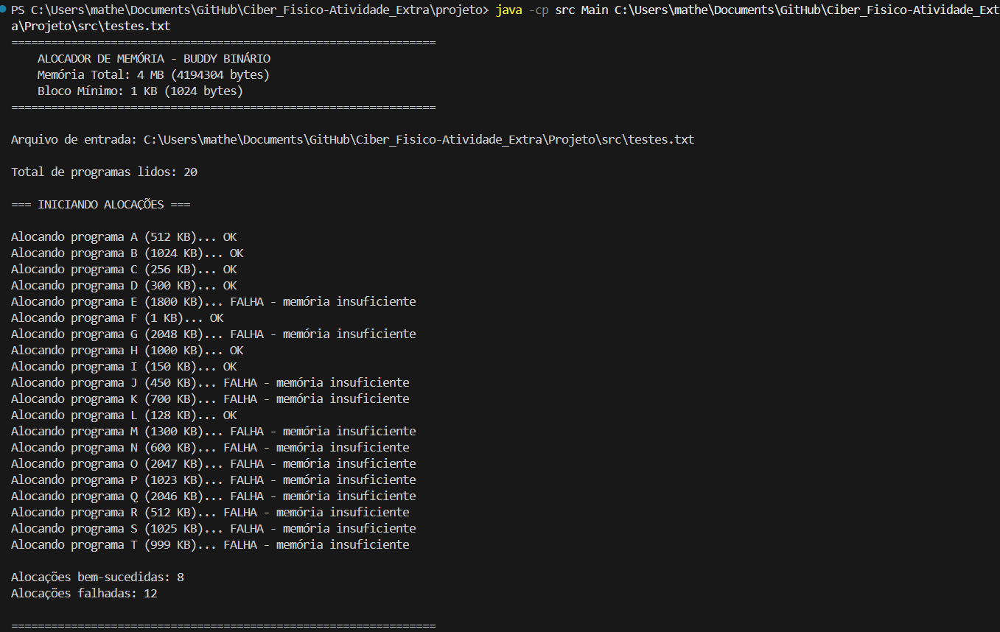
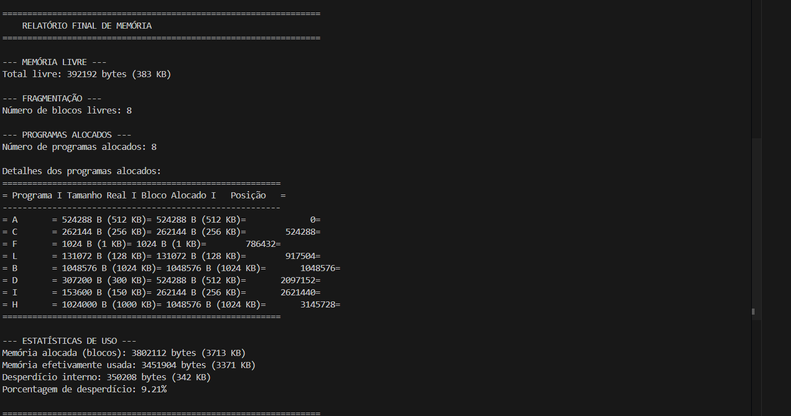

# Ciber_Fisico-Atividade_Extra

## Alunos
Roberto Zhou e Matheus De Bortoli Silva

## Link do Youtube

https://youtu.be/xeXnhpzvDuw

O projeto consiste em um alocador de arquivos pelo sistema Buddy, que é um algoritmo de memória que divide 
blocos de memória em duas metades até que um tamanho adequado para a solicitação seja encontrado

Como o buddy funciona?

## 1-Divisão da memória: O alocador começa com um único bloco de memória e, quando uma solicitação de memória é feita, ele divide esse bloco ao meio repetidamente (em potências de 2) até encontrar um bloco do tamanho apropriado.

## 2-Alocação: Um desses blocos resultantes é alocado para a solicitação, e o outro fica livre e pode ser dividido novamente se necessário.

## 3-Mesclagem: Quando um bloco é liberado, o sistema verifica se seu parceiro ("buddy") também está livre. Se estiver, eles são mesclados para formar um bloco de tamanho maior, reunindo os dois parceiros.

## 4-Objetivo: O objetivo principal é otimizar a alocação e evitar a fragmentação da memória, usando o processo de divisão e mesclagem para gerenciar blocos livres de forma eficiente. 

Fonte: https://www-kernel-org.translate.goog/doc/gorman/html/understand/understand009.html?_x_tr_sl=en&_x_tr_tl=pt&_x_tr_hl=pt&_x_tr_pto=sge#:~:text=O%20algoritmo%20principal%20utilizado%20é,o%20alocador%20lida%20com%20isso.

## Como compilar: 

1- Entre na pasta em que está os arquivos do projeto

javac src/*.java

## Como executar

1- Entre na pasta em que está os arquivos do projeto
2- Copie o caminho do arquivo .txt a ser utilizado

java -cp src Main (camminho do arquivo txt(não precisa do parenteses))

## Como garantir que funcione:

No arquivo .txt salve as informações como a seguir

A 25
B 100
C 700
...

Rotulo | tamanho em KB 1-2048

## Exemplo de Saida

